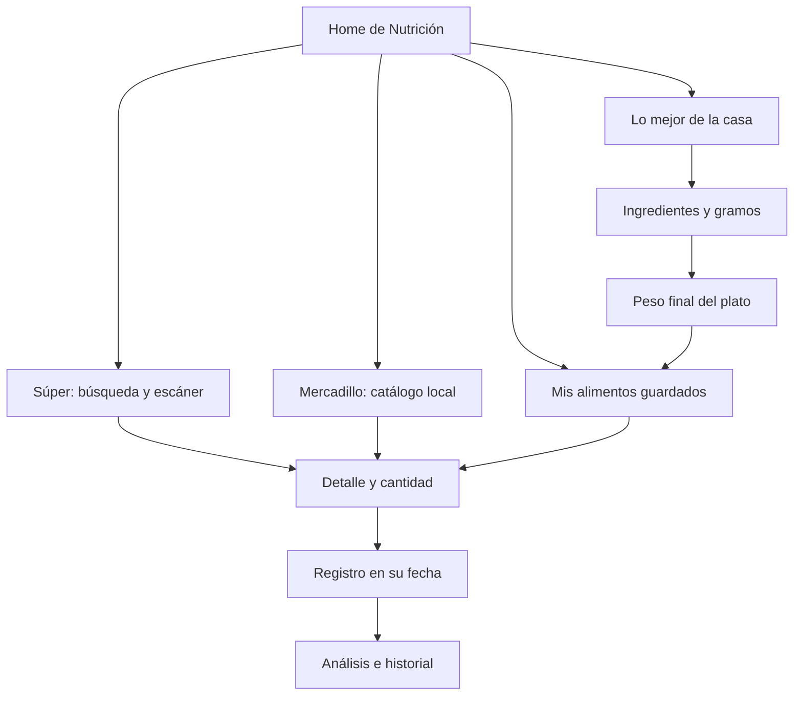

# P0 · Dirección visual y navegación

Fecha: 9 de septiembre de 2026. Referencias: las tres fotos aportadas por el usuario en este hilo. Alcance general vigente: P0–P5; P6–P9 y foros permanecen pausados.

## Decisiones confirmadas

- Navegación inferior con cinco posiciones horizontales. Cada botón tiene un contorno celular propio; no existe una bandeja rectangular opaca detrás del conjunto.
- El ADN ocupa exactamente la posición central y comparte el eje vertical de los demás botones. Su tamaño y tratamiento visual lo distinguen; no se eleva ni se desplaza hacia un lateral.
- Se conservan el toque para elegir área y la pulsación de 1,5 segundos para avanzar por el ciclo configurado.
- Los iconos de la foto 1 son orientativos y no se copian. Se mantienen las funciones de Home, Análisis, Más y Ajustes.
- El contenido se desplaza por detrás de los botones. Cada lista incorpora espacio desplazable al final para permitir que el último control quede por encima de la navegación.
- En el Home de Nutrición: Súper a la izquierda, Mercadillo a la derecha y Lo mejor de la casa debajo, centrado. Los símbolos son carrito, carne y plato con cubiertos.
- El estilo usa los colores de ADNApp y dibujos vectoriales originales. El negro de las fotos no se impone como único fondo; se respetan las apariencias clara y oscura.

## Mapa funcional

Cada destino conserva una vuelta explícita. El selector de áreas mantiene las pilas independientes. Cambiar de catálogo no modifica registros; guardar un plato no significa haberlo comido.

## Foto 3: interpretación provisional

Se interpreta como búsqueda textual y exploración por categorías orgánicas. Se han aplicado burbujas con nombres y dibujos a ambos catálogos: en Súper lanzan búsquedas y en Mercadillo filtran datos locales. Se ha solicitado aclaración al usuario sobre su ubicación definitiva; esta decisión es reversible.

«Burgos» se trata como un ejemplo de texto de búsqueda, no como permiso para añadir geolocalización o un buscador de comercios. Los resultados siguen siendo listas legibles. El rediseño profundo de las tarjetas pertenece a P1.

## Componentes y reglas de diseño

- `CellShape`: silueta continua, determinista y escalable. Variantes con lóbulos para navegación y contornos más redondeados para los accesos de Nutrición.
- `CellSurface`: superficie individual, contorno, estado seleccionado, sombra discreta y detalles de membrana. Su contenedor global es transparente; el interior del botón conserva contraste con lo que pasa por debajo.
- `FoodIllustration`: carrito, carne, plato y familias de alimentos dibujadas en Compose; no dependen de emojis del sistema ni de descargas.
- `LocalFloatingNavigationInset`: espacio final compartido por las listas; se adapta a las barras del sistema y a la desaparición de la navegación al abrir el teclado.
- Se mantiene el significado de los colores por área. La selección también tiene semántica accesible y variación de grosor, no depende solo del color.
- ADN de 80 dp en su espacio central; botones laterales de hasta 72 × 76 dp. Los laterales se ajustan al ancho disponible sin desplazar el centro.
- Etiquetas de navegación de 12 sp, ajustadas por medición real al espacio interior del contorno. Se mantienen completas en una línea, sin puntos suspensivos, y se reduce su tamaño solo cuando es necesario.
- Las etiquetas acompañan las ilustraciones. Los iconos decorativos no duplican las descripciones de los botones.

## Platos propios: aclaración de alcance

Esta función nace de la petición expresa de la foto 2 y se separa de P7, que se refiere a importar recetas externas. La primera base permite componer ingredientes del catálogo local o favoritos del Súper, introducir gramos, editar/quitar ingredientes y guardar el resultado en la biblioteca local.

Se introduce el peso final listo para comer para calcular valores por 100 g tras cocinar. Los cálculos se presentan como estimaciones y se conservan los alérgenos declarados por los ingredientes. No se inventan micronutrientes que las fuentes no aportan.

El guardado es una operación local transaccional, ligada al usuario y con identidad estable durante la edición. Repetir Guardar en la misma edición actualiza el plato sin duplicarlo. El borrador se conserva mediante SavedStateHandle ante recreación; no equivale a una biblioteca completa de recetas editables. Reabrir un plato guardado para reconstruir y editar toda su receta es una ampliación pendiente de P1. Desde Mis alimentos se puede consultar o registrar la cantidad consumida.

## Base para P1–P5

- P1 aplica esta familia gráfica a agua, soles, supermercado y nevera. No necesita rehacer la navegación.
- P2 conecta planificación y registros desde Agenda, con tareas, eventos y objetivos diferenciados.
- P3 conserva el patrón de accesos orgánicos en el selector de deportes, con métricas específicas.
- P4 añade procedencia y última sincronización; no altera la navegación básica.
- P5 adapta los mismos contornos, textos y estados a bizcocho, balanza, hucha y cartera.
- Las áreas todavía sin desarrollar no reciben datos ni análisis simulados.

## Comprobación

Pruebas de navegación: presencia de los tres accesos, destino de cada uno, vuelta al Home, apertura del selector y posición del ADN. Capturas obtenidas mediante pruebas instrumentadas sobre componentes reales, sin añadir un acceso que omita el inicio de sesión a la aplicación de producción.

Pruebas de cálculo: diferencia entre peso crudo y final, identidad estable por usuario, rechazo de cantidades inválidas y conservación de alérgenos. También se comprueban el borrador restaurado, los errores de guardado y la prevención del doble guardado.

Validación realizada: compilación debug correcta, 46 pruebas unitarias sin fallos y lint sin errores. La prueba instrumentada verifica navegación, centrado y alineación del ADN y ausencia de desbordamiento de las cuatro etiquetas. Se ha ejecutado en emulador API 35 con anchura normal y, además, con 320 dp de ancho, fuente del sistema al 130 % y apariencia oscura. Se han revisado capturas reales del Home y los tres destinos; están en `build/p0-review/light` y `build/p0-review/compact-dark`.

P0 deja una base implementada y revisable. Los detalles visuales pueden iterarse con el usuario sobre capturas; no se interpreta que las fotos aprueben por adelantado todos los tamaños, colores o ilustraciones.
